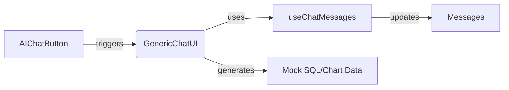

## ProtectedLayout Component Implementation

### File Locations
- Main component: `src/components/ProtectedLayout.tsx`
- Dependent components:
  - `src/components/Sidebar.tsx`
  - `src/components/Header.tsx`
  - `src/components/RightAside.tsx`
  - `src/components/BottomDrawer.tsx`

### Component Hierarchy
- Wraps app content with theme and sidebar contexts
- Orchestrates:
  - `Sidebar` (collapsible)
  - `Header` (fixed position)
  - Main content area (`Outlet` for router)
  - `RightAside` (conditional sidebar)
  - `BottomDrawer` (conditional bottom panel)

### Key Features
1. **Context Providers**:
   - `ThemeProvider`: Manages UI theme
   - `SidebarProvider`: Controls all sidebar/drawer states

2. **Responsive Layout**:
   - Animated sidebar width transition (64px ↔ 20px)
   - Main content area automatically adjusts margin
   - Fixed header with scrollable content below

3. **Conditional Panels**:
   - RightAside: 25% width sidebar for supplementary content
   - BottomDrawer: Flexible-height bottom panel
   - Both render conditionally based on context state

4. **Layout Structure**:
```tsx
<ThemeProvider>
  <SidebarProvider>
    <LayoutWrapper> // Handles panel states
      <Sidebar />
      <MainContent> // Responsive margin
        <Header />
        <Outlet /> // Router content
      </MainContent>
      <ConditionalPanels /> // RightAside + BottomDrawer
    </LayoutWrapper>
  </SidebarProvider>
</ThemeProvider>
```

### Technical Notes
- Uses `cn` utility for conditional Tailwind classes
- Maintains scrollable content area with `h-[calc(100vh-64px)]`
- Implements z-index layering for overlays (z-50)
- Follows React Router layout patterns with Outlet

## Chat System Architecture

### File Locations
- Core components:
  - `src/components/Header.tsx` (integration point)
  - `src/components/shared/ai-chat-button.tsx`
  - `src/components/shared/GenericChatUI.tsx`
- Sub-components:
  - `src/components/shared/chat-components/ChatSQLView.tsx`
  - `src/components/shared/chat-components/ChatChartView.tsx`
  - `src/components/shared/AIChatInput.tsx`

### Component Hierarchy
1. **Header**
   - Renders context-aware header content
   - Integrates `AIChatButton` for chat activation

2. **AIChatButton**
   - Manages RightAside state
   - Animates chat toggle
   - Passes `GenericChatUI` to sidebar

3. **GenericChatUI**
   - Core chat interface with:
     - Message history
     - SQL/Chart tabs
     - Input system
     - Mock data handling

### Key Features
1. **Contextual Integration**:
```tsx
// Header.tsx routing logic
if (isDataOpsHubRoute(path)) {
  return (
    <div className={cn(...)}>
      <NavigationBreadcrumb />
      <AIChatButton variant="dataops" />
    </div>
  )}
```

2. **State Management**:
- Uses `useSidebar` context for panel control
- `useChatMessages` hook for message history
- Mock response state for demo data

3. **UI Patterns**:
- Animated message bubbles with color theming
- Responsive tabs for data visualization
- Gradient backgrounds and blur effects
- Smart input suggestions

4. **Data Flow**:


### Technical Notes
- Uses `framer-motion` for animations
- Implements custom scroll areas
- Follows compound component pattern
- Type-safe props interfaces
{{ ... }}