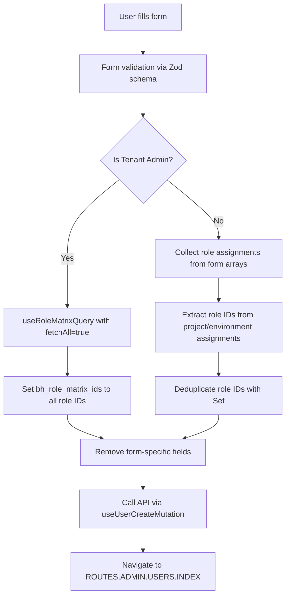

# User Management System - Knowledge Base

## Table of Contents
1. [System Overview](#system-overview)
2. [Architecture](#architecture)
3. [Core Components](#core-components)
4. [Data Flow](#data-flow)
5. [Role Management System](#role-management-system)
6. [Type System](#type-system)
7. [API Integration](#api-integration)
8. [UI/UX Patterns](#uiux-patterns)
9. [Technical Patterns](#technical-patterns)
10. [Implementation Details](#implementation-details)

---

## System Overview

A React-based user management system with hierarchical role-based access control (RBAC). The system allows administrators to create and manage users with granular permissions across projects and environments using a role matrix approach.

### Key Features
- **Multi-tier Permission System**: Tenant Admin → Project Access → Environment-specific Access
- **Dynamic Role Fetching**: Roles are loaded based on project/environment selections via role matrix API
- **Form-driven UI**: Single form component handles both user creation and editing with type safety
- **Role Matrix Integration**: Uses backend role matrix system for granular permission management
- **Redux State Management**: Projects and environments loaded from global state

---

## Architecture

### High-Level Structure
```
AddUser (Page)
├── UserForm<T> (Generic Form Component)
│   ├── User Information Section
│   ├── Admin Role Section (with role fetching)
│   └── Role Assignments Section (conditional)
│       ├── ProjectRolesField (with useRoleMatrixQuery)
│       └── EnvironmentRolesField (with useRoleMatrixQuery)
└── API Integration (useUserCreateMutation)
```

### Component Hierarchy
- **Page Level**: `AddUser` - Orchestrates user creation flow with payload transformation
- **Form Level**: `UserForm<T extends BaseUserFields>` - Generic form with create/edit modes
- **Field Level**: `ProjectRolesField`, `EnvironmentRolesField` - Specialized role assignment with accordion UI
- **Hook Level**: `useRoleMatrixQuery` - Dynamic role fetching based on context
- **Input Level**: `MultiSelect` - Multi-selection dropdown with search and badges

---

## Core Components

### 1. UserForm Component
**File**: `src/features/admin/users/components/UserForm.tsx`
**Purpose**: Generic form component supporting both user creation and editing

#### Key Features:
- **Generic TypeScript Implementation**: `UserForm<T extends BaseUserFields>`
- **Mode-based Schema**: `userCreateSchema` vs `userEditSchema` from Zod
- **Conditional Rendering**: Role assignments hidden for tenant admins
- **State Management**: Tracks form submission states (idle, submitting, success, error)
- **Tenant Admin Integration**: Automatically fetches all roles when tenant admin is enabled

#### Form Sections:
1. **User Information**: Basic user details (first_name, last_name, email)
2. **Admin Role**: Tenant admin toggle with automatic role fetching via `useRoleMatrixQuery`
3. **Role Assignments**: Project and environment-specific permissions (accordion-based UI)

#### Type Safety:
```typescript
interface BaseUserFields {
  first_name?: string;
  last_name?: string;
  email?: string;
  is_tenant_admin?: boolean;
}

type UserFormProps<T extends BaseUserFields = AnyUserFormValues> = {
  initialData?: Partial<T>;
  onSubmit: (data: T) => Promise<void>;
  mode: "create" | "edit";
  isSubmitting: boolean;
  error: string | null;
  user?: User;
};
```

### 2. FormFields Components
**File**: `src/features/admin/users/components/FormFields.tsx`
**Purpose**: Specialized field components for role assignments

#### ProjectRolesField:
- **Dynamic Role Fetching**: Uses `useRoleMatrixQuery({ projectId, enabled })` based on selected project
- **Accordion UI**: Expandable sections for multiple project assignments
- **Assignment Summary**: Shows "Project Name → Role1, Role2" format
- **Redux Integration**: Gets project options from `state.users.projects`
- **Field Array Management**: Uses `useFieldArray` for dynamic project assignments

#### EnvironmentRolesField:
- **Environment-specific Roles**: Uses `useRoleMatrixQuery({ environmentId, enabled })`
- **Independent Role Fetching**: Each environment gets its own role set
- **Similar UI Pattern**: Accordion-based with assignment summaries
- **Redux Integration**: Gets environment options from `state.users.environments`

#### Role Option Transformation:
```typescript
const roleOptions = fetchedRoles?.map(role => ({
  label: role.role_name
    .split('_')
    .map(part => part.charAt(0).toUpperCase() + part.slice(1))
    .join(' '),
  value: String(role.id) // Role matrix ID as string
})) || []
```

### 3. MultiSelect Component
**File**: `src/features/admin/users/components/MultiSelect.tsx`
**Purpose**: Advanced multi-selection dropdown with search capabilities

#### Features:
- **Search Functionality**: Built-in filtering via Command component
- **Badge Display**: Selected items shown as removable badges
- **Accessibility**: Full keyboard navigation support
- **Visual Feedback**: Checkboxes indicate selection state
- **Form Integration**: Works with react-hook-form field arrays

---

## Data Flow

### User Creation Flow


### Form Data Transformation
```typescript
// Form Data Structure (UI-friendly)
{
  first_name: "John",
  last_name: "Doe", 
  email: "john@example.com",
  is_tenant_admin: false,
  project_assignments: [
    { project: "proj1", roles: ["role1", "role2"] }
  ],
  environment_assignments: [
    { environment: "env1", roles: ["role3"] }
  ]
}

// API Payload Structure (backend-friendly)
{
  first_name: "John",
  last_name: "Doe",
  email: "john@example.com", 
  is_tenant_admin: false,
  bh_role_matrix_ids: ["role1", "role2", "role3"] // Flattened & deduplicated
}
```

### Role Assignment Processing:
```typescript
// Extract role matrix IDs from assignments
const roleMatrixIds: string[] = [];

// Process project assignments
data.project_assignments?.forEach(assignment => {
  if (assignment.roles?.length) {
    roleMatrixIds.push(...assignment.roles);
  }
});

// Process environment assignments  
data.environment_assignments?.forEach(assignment => {
  if (assignment.roles?.length) {
    roleMatrixIds.push(...assignment.roles);
  }
});

// Deduplicate and add to payload
payload.bh_role_matrix_ids = [...new Set(roleMatrixIds)];
```

---

## Role Management System

### Role Matrix Architecture
The system uses a "Role Matrix" approach where roles are mapped to specific project-environment combinations with granular permissions.

#### Available Roles:
```typescript
export const AVAILABLE_ROLES = ["designer", "ops_user", "viewer", "qa", "tenant_admin"] as const;
```

#### Role Hierarchy:
1. **Tenant Admin**: Full system access (bypasses matrix, gets all roles)
2. **Project Roles**: Access to entire projects (all environments within)
3. **Environment Roles**: Granular access to specific environments

#### Role Matrix Entry Structure:
```typescript
interface RoleMatrixEntry extends Role {
  created_at: string;
  updated_at: string;
  created_by: string;
  updated_by: string;
  is_deleted: boolean | null;
  deleted_by: string | null;
}

interface Role {
  tenant_key: string;
  id: number;
  bh_role_matrix_id: number;
  module_type: string;
  module_name: string;
  role_name: string;
  project_id: string | "*";
  environment_id: string | "*";
  bh_view: boolean;
  bh_edit: boolean;
  bh_delete: boolean;
}
```

### useRoleMatrixQuery Hook
**File**: `src/features/admin/users/hooks/useRoleMatrixQuery.ts`
**Purpose**: Dynamically fetch available roles based on context

#### Complete Parameter Set:
```typescript
interface UseRoleMatrixQueryOptions {
  projectId?: string;
  environmentId?: string;
  offset?: number;
  limit?: number;
  orderBy?: string;
  orderDesc?: boolean;
  enabled?: boolean;
  fetchAll?: boolean;
}
```

#### API Integration:
- **Endpoint**: `/module/role_matrix/list/`
- **Base URL**: `KEYCLOAK_API_REMOTE_URL`
- **Resource Type**: "role-matrix"
- **Method**: GET with query parameters

#### Smart Fetching Logic:
```typescript
const queryParams = useMemo(() => {
  const params: Record<string, string | number | boolean> = {
    offset,
    limit,
    order_by: orderBy,
    order_desc: orderDesc,
  };
  
  if (fetchAll) {
    // Tenant admin gets all roles
    params.project_id = "*";
    params.environment_id = "*";
  } else {
    if (projectId) params.project_id = projectId;
    if (environmentId) params.environment_id = environmentId;
  }
  
  return params;
}, [projectId, environmentId, offset, limit, orderBy, orderDesc, fetchAll]);

const shouldFetch = enabled && (fetchAll || Boolean(projectId) || Boolean(environmentId));
```

#### API Response:
```typescript
interface ApiRoleMatrixResponse {
  total: number;
  next: boolean;
  prev: boolean;
  offset: number;
  limit: number;
  data: RoleMatrixEntry[];
}
```

---

## Type System

### Form Schema Types
**File**: `src/features/admin/users/components/userFormSchema.ts`

#### Zod Schemas:
```typescript
// Base schema with common fields
const baseUserSchema = {
  first_name: z.string().min(1, 'First name is required'),
  last_name: z.string().min(1, 'Last name is required'),
  email: z.string().email('Invalid email address'),
  is_tenant_admin: z.boolean().optional(),
  assignments: z.array(roleAssignmentSchema).optional(), // Legacy
  project_assignments: z.array(projectRoleAssignmentSchema).optional(),
  environment_assignments: z.array(environmentRoleAssignmentSchema).optional(),
} as const;

// Create mode schema - minimal fields only
export const userCreateSchema = z.object({ ...baseUserSchema });

// Edit mode schema - includes additional fields
export const userEditSchema = z.object({
  ...baseUserSchema,
  username: z.string().optional(),
  enabled: z.boolean().optional(),
  emailVerified: z.boolean().optional(),
});
```

#### Assignment Schemas:
```typescript
// Project role assignment schema
const projectRoleAssignmentSchema = z.object({
  project: z.string().min(1, 'Project is required'),
  roles: z.array(z.string()).optional(),
});

// Environment role assignment schema
const environmentRoleAssignmentSchema = z.object({
  environment: z.string().min(1, 'Environment is required'),
  roles: z.array(z.string()).optional(),
});

// Legacy role assignment schema (for backward compatibility)
const roleAssignmentSchema = z.object({
  project: z.union([z.literal('*'), z.string().min(1, 'Project is required')]),
  environment: z.union([z.literal('*'), z.string().min(1, 'Environment is required')]),
  role: z.enum(AVAILABLE_ROLES, { invalid_type_error: 'Role is required' }),
});
```

#### Exported Types:
```typescript
export type UserFormValues = z.infer<typeof userEditSchema>;
export type UserCreateValues = z.infer<typeof userCreateSchema>;

export interface ProjectRoleAssignment {
  project: string;
  roles?: string[];
}

export interface EnvironmentRoleAssignment {
  environment: string;
  roles?: string[];
}

export interface SelectOption {
  label: string;
  value: string;
}
```

#### Helper Functions:
```typescript
export const getProjectOptions = (projects: Project[]): SelectOption[] => {
  if (!Array.isArray(projects)) return [];
  return projects.map(project => ({
    label: project.bh_project_name,
    value: String(project.bh_project_id),
  }));
};

export const getEnvironmentOptions = (environments: Environment[]): SelectOption[] => {
  if (!Array.isArray(environments)) return [];
  return environments.map(env => ({
    label: env.bh_env_name,
    value: String(env.bh_env_id),
  }));
};
```

### Role Types
**File**: `src/types/admin/roles.ts`

#### Core Role Types:
```typescript
export const AVAILABLE_ROLES = ["designer", "ops_user", "viewer", "qa", "tenant_admin"] as const;
export type AppRoles = (typeof AVAILABLE_ROLES)[number];

export type RoleType<T extends string = AppRoles> = {
  [K in T]?: boolean;
};

export type ScopedRoles<T extends string = AppRoles> = {
  [name: string]: RoleType<T>;
};

export interface UserRole<T extends string = AppRoles> {
  tenant_admin: boolean;
  projects: ScopedRoles<T>;
  environments: ScopedRoles<T>;
}
```

### Generic Form Types:
```typescript
// Base fields present in both create and edit forms
interface BaseUserFields {
  first_name?: string;
  last_name?: string;
  email?: string;
  is_tenant_admin?: boolean;
}

// Union of all possible form values
type AnyUserFormValues = UserCreateValues | UserFormValues;

// Type guard for runtime type checking
export function isEditFormValues(values: AnyUserFormValues): values is UserFormValues {
  return 'enabled' in values;
}
```

---

## API Integration

### useResource Hook Pattern
The system uses a custom `useResource` hook for API operations:
- **Base URL**: `KEYCLOAK_API_REMOTE_URL`
- **Resource Type**: "role-matrix"
- **Query Integration**: Built on React Query for caching and error handling
- **Pagination Support**: Built-in offset/limit pagination

### Role Matrix API Usage:
```typescript
const { getAll } = useResource<RoleMatrixEntry>(
  "role-matrix",
  KEYCLOAK_API_REMOTE_URL,
  true,
);

const {
  data: response,
  isLoading,
  isFetching,
  isError,
} = getAll<ApiRoleMatrixResponse>({
  url: "/module/role_matrix/list/",
  params: queryParams,
  queryOptions: {
    enabled: shouldFetch,
    retry: 2,
  },
});
```

### Error Handling Strategy
- **Form Level**: Error state management in UserForm with Alert components
- **API Level**: Mutation error handling in AddUser with try/catch
- **User Feedback**: Visual error states and descriptive error messages
- **Retry Logic**: Built-in retry (2 attempts) for role matrix queries

---

## UI/UX Patterns

### Design System
- **Component Library**: shadcn/ui components (Card, Button, Form, etc.)
- **Styling**: Tailwind CSS with utility classes and custom color schemes
- **Icons**: Lucide React icon library (UserIcon, Shield, Settings, etc.)
- **Layout**: Responsive grid layouts with proper spacing

### User Experience Features
- **Progressive Disclosure**: Accordion-based role assignment sections with summaries
- **Visual Hierarchy**: Color-coded borders (blue for user info, orange for admin, green for roles)
- **Loading States**: Spinner indicators during API calls and form submission
- **Success Feedback**: Form state transitions with visual cues and icons
- **Badge System**: Role assignments shown as removable badges with counts

### Accessibility Features
- **Form Validation**: Real-time validation with clear error messages
- **Keyboard Navigation**: Full keyboard support in MultiSelect and accordions
- **Screen Readers**: Proper ARIA labels and semantic markup
- **Focus Management**: Logical tab order throughout forms
- **Color Contrast**: Proper contrast ratios for all text and interactive elements

### Visual Design Patterns:
```typescript
// Form state visual feedback
const buttonClass = `px-8 w-48 ${
  formState === "submitting" ? "bg-blue-500 hover:bg-blue-600" : 
  formState === "success" ? "bg-green-500 hover:bg-green-600" : 
  formState === "error" ? "bg-red-500 hover:bg-red-600" : 
  "bg-primary hover:bg-primary/90"
}`;
```

---

## Technical Patterns

### Modern React Patterns
- **Functional Components**: No class components, hooks-based architecture
- **Custom Hooks**: `useRoleMatrixQuery`, `useUserCreateMutation`, `useFieldArray`
- **Hook Composition**: `useWatch` for reactive form updates, `useMemo` for performance
- **Context Integration**: Redux for global state (users.projects, users.environments)
- **Error Boundaries**: Proper error handling with try/catch and error states

### TypeScript Best Practices
- **Generic Components**: `UserForm<T extends BaseUserFields>` for type safety
- **Type Guards**: `isEditFormValues()` for runtime type checking
- **Strict Typing**: All props, return types, and API responses properly typed
- **Zod Integration**: Runtime validation with automatic type inference
- **Union Types**: `AnyUserFormValues` for flexible form handling

### Performance Optimizations
- **Conditional Fetching**: Roles only loaded when needed based on selections
- **Memoization**: `useMemo` for query parameters to prevent unnecessary re-renders
- **Smart Re-renders**: `useWatch` for targeted form updates instead of full re-renders
- **Debouncing**: Built-in React Query debouncing for API calls
- **Lazy Loading**: Role data fetched on-demand based on user selections

### Code Organization
- **Feature-based Structure**: Components grouped by functionality under `/admin/users/`
- **Separation of Concerns**: Hooks, components, schemas, and types in separate files
- **Reusable Components**: MultiSelect, FormFields abstracted for reuse across forms
- **Barrel Exports**: Clean import/export patterns for better maintainability

---

## Implementation Details

### File Structure
```
src/features/admin/users/
├── AddUser.tsx                     # Main page component
├── components/
│   ├── UserForm.tsx               # Generic form component
│   ├── FormFields.tsx             # Role assignment fields
│   ├── userFormSchema.ts          # Zod schemas and types
│   ├── MultiSelect.tsx            # Multi-selection component
│   └── UserPageLayout.tsx         # Layout wrapper
├── hooks/
│   ├── useRoleMatrixQuery.ts      # Role fetching hook
│   └── useUserCreateMutation.ts   # User creation mutation
└── types/
    └── (imported from @/types/admin/)
```

### Redux Integration
The system integrates with Redux for global state management:
```typescript
// Projects and environments loaded from Redux state
const projects = useAppSelector((state) => state.users.projects);
const environments = useAppSelector((state) => state.users.environments);

// Helper functions safely handle array checks
const projectOptions = getProjectOptions(projects);
const environmentOptions = getEnvironmentOptions(environments);
```

### Form State Management
```typescript
const [formState, setFormState] = useState<"idle" | "submitting" | "success" | "error">("idle");

const handleSubmit = async (data: T) => {
  try {
    setFormState("submitting");
    // Process payload...
    await onSubmit(payload as T);
    setFormState("success");
  } catch (err) {
    setFormState("error");
  }
};
```

### Role Assignment Summary Generation
```typescript
const getAssignmentSummary = (index: number) => {
  const project = form.watch(`project_assignments.${index}.project`) || '';
  const roles: string[] = form.watch(`project_assignments.${index}.roles`) || [];
  
  if (!project || roles.length === 0) {
    return "Configure assignment";
  }
  
  const projectLabel = projectOptions.find(p => p.value === project)?.label;
  const roleLabels = roles.map(r => roleOptions.find(ro => ro.value === r)?.label).filter(Boolean).join(', ');
  return `${projectLabel} → ${roleLabels}`;
};
```

### Tenant Admin Role Handling
```typescript
// Watch tenant admin status for conditional role fetching
const isTenantAdmin = Boolean(form.watch('is_tenant_admin' as Path<T>));

// Fetch all roles when tenant admin is enabled
const { roles: allRoles = [], isLoading: isLoadingRoles } = useRoleMatrixQuery({
  fetchAll: isTenantAdmin,
  enabled: isTenantAdmin
});

// Add all role IDs to payload for tenant admin
if (payload.is_tenant_admin && allRoles.length > 0) {
  payload.bh_role_matrix_ids = allRoles.map(role => role.id);
}
```

This completes the comprehensive documentation of the user management system implementation. All previously "pending information" has been resolved with actual implementation details.