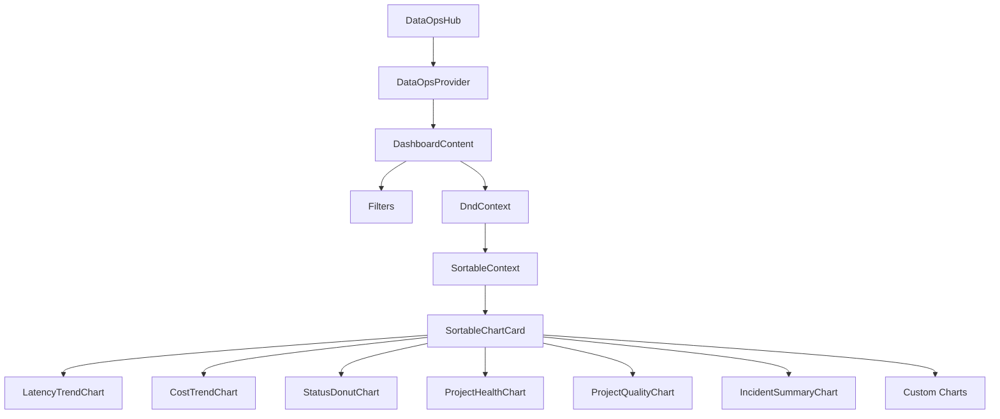
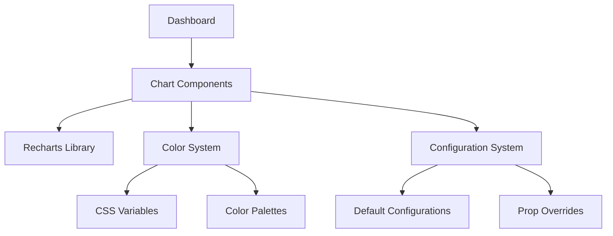

##  Component Implementation
## Application Root Implementation

### File Location
- Main component: `src/App.tsx`

## ProtectedLayout page routing 

### File Location
- Main component: `src/routes/index.tsx`
- my focus - `src\routes\dataOpsRoutes.tsx`
---------------------------

## DataOps Hub Implementation

### File Location
- Main component: `src/pages/dataops/DataopsHub.tsx`

### File Location
- Main component: `src/features/dataops/DataOpsHub.tsx`
- Context: `src/context/dataops/DataOpsContext.tsx`
- Dashboard: `src\features\dataops\dashboard\index.tsx`

# DataOpsHub Dashboard Implementation

## Architecture Overview

The DataOpsHub dashboard follows a modern React architecture with context-based state management, dynamic layout, and interactive components. This document details the implementation of the dashboard's features and components.

## Component Hierarchy



## File Structure

- **Main Component**: `src/features/dataops/DataOpsHub.tsx`
- **Context Provider**: `src/context/dataops/DataOpsContext.tsx`
- **Dashboard Implementation**: `src/features/dataops/dashboard/index.tsx`
- **Filter Components**: `src/features/dataops/dashboard/filterSelect.tsx`
- **Chart Components**: `src/features/dataops/dashboard/charts.tsx`
- **Chart Container**: `src/features/dataops/dashboard/SortableChartCard.tsx`
- **Hooks**: `src/hooks/useFilter.tsx`
- **Routing Configuration**: `src/routes/dataOpsRoutes.tsx`

## State Management

### DataOpsContext

The dashboard uses a centralized context for state management:

1. **Data Management**:
   - `allData`: Raw data generated for the dashboard
   - `filteredData`: Data filtered by user-selected criteria
   - `chartData`: Processed data for each chart type

2. **Filter Management**:
   - Four filter types: Project, Pipeline, Status, and Duration
   - Filter persistence via cookies
   - Filter reset and load functionality

3. **Chart Management**:
   - `chartOrder`: Array controlling chart display order
   - `customCharts`: Array of dynamically added charts
   - Chart addition mechanism with event listener integration

### useFilter Hook Implementation

The dashboard uses a custom hook to abstract filter operations from the DataOpsContext:

```tsx
// src/hooks/useFilter.tsx
import { useDataOps } from "@/context/dataops/DataOpsContext"

export const useFilters = () => {
  const { filters, handleFilterChange, resetFilters, loadSavedFilters } = useDataOps()
  return { filters, handleFilterChange, resetFilters, loadSavedFilters }
}
```

This hook provides a clean abstraction that:
- Simplifies component access to filter functionality
- Maintains consistent filter operations across components
- Follows the React hooks pattern for state consumption

## Features

### 1. Drag-and-Drop Chart Reordering

The dashboard implements drag-and-drop functionality using `@dnd-kit/core` and `@dnd-kit/sortable`:

- Draggable charts with visual feedback during drag operations
- Automatic reordering of charts with animation
- Persistence of chart order in state
- Optimized sensor configuration to prevent accidental drags

### 2. Advanced Filtering System

The filtering system offers:

- Multiple filter dimensions: Project, Pipeline, Status, Duration
- Duration-based filtering with automatic date calculations
- Filter persistence between sessions via cookies
- Reset functionality to clear all filters at once

### 3. Responsive Layout

The dashboard implements responsive design:

- Dynamic grid layout (1-3 columns based on viewport width)
- Optimized chart heights based on available space
- ResizeObserver for real-time layout adjustments
- Local storage for persisting optimal chart heights

### 4. Chart Integration

Charts are implemented as standalone components with:

- Consistent interface for data consumption
- Type-specific rendering based on chart ID
- Support for custom charts added via chat interface
- Integration with the AI chat system for dynamic chart generation

### 5. Custom Chart Support

The system supports dynamic addition of custom charts:

- Event-based chart addition mechanism
- Automatic chart order updates when new charts are added
- Chart config options (axes, labels, etc.)
- Integration with chat UI for natural language chart creation

## Technical Implementation Details

### 1. Chart Components Implementation

The `charts.tsx` file implements a collection of chart components with consistent styling and behavior:

```tsx
// Color management with CSS variables
const CHART_COLORS = {
  chart1: "var(--chart-1-color)", 
  chart2: "var(--chart-2-color)", 
  chart3: "var(--chart-3-color)", 
  chart4: "var(--chart-4-color)",
  chart5: "var(--chart-5-color)"
}

// Organized color palettes for different chart types
const palettes = {
  status: [CHART_COLORS.chart1, CHART_COLORS.chart2, CHART_COLORS.chart3, CHART_COLORS.chart4],
  trend: [CHART_COLORS.chart1, CHART_COLORS.chart2, CHART_COLORS.chart3, CHART_COLORS.chart4, CHART_COLORS.chart5],
  comparison: [CHART_COLORS.chart1, CHART_COLORS.chart3, CHART_COLORS.chart5]
}

// Default configurations for each chart type
const chartDefaults = {
  lineConfig: {
    colors: palettes.trend,
    stroke: CHART_COLORS.chart1,
    strokeWidth: 2,
    // Additional configuration...
  },
  // Other chart configurations...
}

// Chart component example
export const LatencyTrendChart: React.FC<{ title?:string; data: any[] }> = ({ title="Latency", data }) => {
  const lines = Object.keys(data[0] || {}).filter((key) => key !== "name");
  
  return (
    <SortableChartCard id="latency" title={title} className="bg-gradient-to-br from-card to-card/95 overflow-hidden">
      <LineChart 
        data={data} 
        xAxisDataKey="name" 
        lines={lines}
        colors={palettes.trend}
        config={{
          ...chartDefaults.lineConfig,
          yAxisLabel: "ms"
        }}
      />
    </SortableChartCard>
  )
}
```

Key implementation details:
- **Color System**: Uses CSS variables for theming consistency
- **Configuration Presets**: Predefined settings for each chart type
- **Component Pattern**: Consistent props structure across charts
- **Chart Wrapping**: Each chart is wrapped in a SortableChartCard
- **Dynamic Data Processing**: Extracts data keys automatically where possible

### 2. SortableChartCard Implementation

The SortableChartCard component in `SortableChartCard.tsx` provides the container for all chart components with advanced interactive features:

```tsx
export const SortableChartCard: React.FC<SortableChartCardProps> = ({ 
  id,
  title, 
  children, 
  className,
  defaultHeight = 300,
  onSaveHeight
}) => {
  const [height, setHeight] = useState(defaultHeight);
  const [isResizing, setIsResizing] = useState(false);
  
  // Refs for resize operation
  const startYRef = useRef<number>(0);
  const cardRef = useRef<HTMLDivElement>(null);

  // dnd-kit sortable hook
  const {
    attributes,
    listeners,
    setNodeRef,
    transform,
    transition,
    isDragging
  } = useSortable({ id, disabled: isResizing });
  
  // Debounced dimension saving
  const debouncedSave = useCallback(
    debounce((newHeight: number, newWidth: string) => {
      onSaveHeight?.(newHeight);
      localStorage.setItem(`chart-${title}-dimensions`, JSON.stringify({
        height: newHeight,
        width: newWidth
      }));
    }, 250),
    [title, onSaveHeight]
  );

  // Additional implementation details...

  return (
    <Card
      ref={setNodeRef}
      className={cn(
        "relative",
        className,
        isDragging && "opacity-70 z-10"
      )}
      style={{
        transform: CSS.Transform.toString(transform),
        transition,
        height: `${height}px`,
      }}
    >
      {/* Card header with drag handle */}
      <CardHeader className="flex flex-row items-center justify-between space-y-0 p-4 pb-2">
        <CardTitle className="text-sm font-medium flex items-center">
          <div
            {...attributes}
            {...listeners}
            className="cursor-grab mr-2 px-1 rounded-sm hover:bg-accent"
          >
            <GripVertical className="h-4 w-4 text-muted-foreground" />
          </div>
          {title}
        </CardTitle>
        {/* Menu and options */}
      </CardHeader>

      {/* Chart content */}
      <CardContent className="p-0 px-4 pb-4">
        <div className="h-[calc(100%-38px)]">
          <ResponsiveContainer width="100%" height="100%">
            {children}
          </ResponsiveContainer>
        </div>
      </CardContent>
      
      {/* Resize handle */}
      <div
        className="absolute bottom-0 w-full h-1 cursor-ns-resize bg-transparent hover:bg-accent/30"
        onMouseDown={handleResizeStart}
      />
    </Card>
  );
};
```

Key features:
1. **Drag-and-Drop**: Integration with `useSortable` from dnd-kit
2. **Resizable Height**: Mouse-based resizing with min/max constraints
3. **Persistence**: Local storage of chart dimensions with debounced saving
4. **Adaptive Layout**: Responds to global optimal height calculations
5. **Interaction Feedback**: Visual cues during drag and resize operations
6. **Error Handling**: Built-in error boundary for chart rendering failures

### 3. Dynamic Chart Rendering

Charts are rendered conditionally using a switch statement inside the `renderChart` function:

```tsx
const renderChart = (chartId: string) => {
  if (chartId.startsWith('custom-')) {
    // Handle custom charts
    const customChartId = chartId.replace('custom-', '');
    const customChart = customCharts.find(chart => chart.id === customChartId);
    return <ProjectHealthChart title={"Latency 2"} data={customChart?.data} bars={["success"]} />
  }
    
  switch (chartId) {
    case "latency":
      return <LatencyTrendChart data={chartData.latency} />
    case "cost":
      return <CostTrendChart data={chartData.cost} />
    // Additional chart types...
    default:
      return <div>Chart not implemented</div>
  }
}
```

### 4. Layout Optimization

The dashboard uses a ResizeObserver to optimize chart heights based on available space:

```tsx
useEffect(() => {
  const adjustChartHeights = () => {
    if (!gridContainerRef.current) return;
    
    const containerHeight = gridContainerRef.current.clientHeight;
    const containerWidth = gridContainerRef.current.clientWidth;
    const numColumns = containerWidth >= 1024 ? 3 : containerWidth >= 768 ? 2 : 1;
    
    // Calculate optimal chart height
    const numRows = Math.ceil(chartOrder.length / numColumns);
    const availableHeight = containerHeight - 10;
    const optimalHeight = Math.floor(availableHeight / numRows) - 30;
    
    // Store calculated height in localStorage
    localStorage.setItem('optimal-chart-height', String(Math.max(80, Math.min(optimalHeight, 400))));
  };
  
  // Set up observer
  const resizeObserver = new ResizeObserver(adjustChartHeights);
  if (gridContainerRef.current) {
    resizeObserver.observe(gridContainerRef.current);
  }
  
  return () => {
    resizeObserver.disconnect();
  };
}, [chartOrder])
```

### 5. Drag-and-Drop Implementation

The drag-and-drop functionality uses the following pattern:

```tsx
// Configure sensors with activation constraints
const sensors = useSensors(
  useSensor(PointerSensor, {
    activationConstraint: { distance: 5 },
  })
);

// Handle drag start with visual feedback
const handleDragStart = (event: DragStartEvent) => {
  setIsDragging(true);
  setActiveId(event.active.id as string);
  document.body.classList.add('dragging-active');
};

// Handle drag end with array reordering
const handleDragEnd = (event: DragEndEvent) => {
  setIsDragging(false);
  setActiveId(null);
  document.body.classList.remove('dragging-active');
  
  const { active, over } = event;
  
  if (!over) return;
  
  if (active.id !== over.id) {
    const oldIndex = chartOrder.findIndex(chartId => chartId === active.id);
    const newIndex = chartOrder.findIndex(chartId => chartId === over.id);
    
    setChartOrder(arrayMove(chartOrder, oldIndex, newIndex));
  }
};
```

### 6. Filter State Management

The filter state management uses React's useState and useCallback:

```tsx
const [filters, setFilters] = useState({
  project: "All" as FilterOption,
  pipeline: "All" as FilterOption,
  status: "All" as FilterOption,
  duration: "All" as FilterOption,
});

const handleFilterChange = useCallback((key: string, value: FilterOption) => {
  setFilters((prev) => {
    const newFilters = { ...prev, [key]: value }
    setCookie("dashboardFilters", JSON.stringify(newFilters), 30)
    return newFilters
  })
}, []);
```

### 7. AI Chat Integration

The dashboard integrates with the AI chat system for dynamic chart generation:

```tsx
useEffect(() => {
  const handleChartAdded = (event: CustomEvent) => {
    const chartData = event.detail;
    addCustomChart(chartData);
  };

  document.addEventListener(CHART_ADDED_EVENT, handleChartAdded as EventListener);

  return () => {
    document.removeEventListener(CHART_ADDED_EVENT, handleChartAdded as EventListener);
  };
}, [addCustomChart]);
```

## Component Dependencies

### Chart Library Implementation

The dashboard utilizes a custom chart library implemented in `src/components/bh-charts/` that provides consistent chart components built on top of Recharts:



#### Key Components:

1. **Base Chart Components**:
   - `LineChart.tsx`: Line charts for trend visualization
   - `BarChart.tsx`: Bar charts for comparison data
   - `AreaChart.tsx`: Area charts for cumulative data
   - `DonutChart.tsx`: Donut charts for proportional data
   - `ChartToolbar.tsx`: Interactive chart customization toolbar

2. **Chart Component Example**:
```tsx
// LineChart simplified implementation
export const LineChart: React.FC<LineChartProps> = ({ 
  data, 
  xAxisDataKey, 
  lines, 
  colors = colorPalettes.supersetColors,
  config = {},
  isMultiSeries = false
}) => {
  // Convert string values to numbers for chart rendering
  const processedData = useMemo(() => {
    // Data processing logic...
  }, [data, lines, xAxisDataKey, isMultiSeries]);
  
  // Component rendering with configuration
  return (
    <RechartsLineChart data={processedData}>
      <CartesianGrid 
        strokeDasharray="3 3"
        vertical={config.showGrid !== false} 
        horizontal={config.showGrid !== false} 
      />
      <XAxis 
        dataKey={xAxisDataKey} 
        // XAxis configuration...
      />
      <YAxis 
        // YAxis configuration...
      />
      <Tooltip />
      {config.showLegend !== false && (
        <Legend 
          // Legend configuration...
        />
      )}
      
      {/* Render lines based on data keys */}
      {multiSeriesLines.length > 0 ? (
        // Multi-series rendering logic
      ) : (
        // Standard line rendering logic
        lines.map((line, index) => (
          <Line
            key={line}
            type={config.curveType || "monotone"}
            dataKey={line}
            stroke={colors[index % colors.length]}
            strokeWidth={config.strokeWidth || 2}
            // Line configuration...
          />
        ))
      )}
    </RechartsLineChart>
  );
};
```

3. **Color System**:
   The chart library implements a sophisticated color system:

   ```tsx
   // From index.ts
   export const colorPalettes = {
     blueToGreen: ["#0000FF", "#00FFFF", "#00FF00"],
     colorsOfRainbow: ["#FF0000", "#FF7F00", "#FFFF00", "#00FF00", "#0000FF", "#4B0082", "#8F00FF"],
     modernSunset: ["#003f5c", "#58508d", "#bc5090", "#ff6361", "#ffa600"],
     presetSuperset: ["#003f5c", "#2f4b7c", "#665191", "#a05195", "#d45087", "#f95d6a", "#ff7c43", "#ffa600"],
     presetColors: ["#66c2a5", "#fc8d62", "#8da0cb", "#e78ac3", "#a6d854", "#ffd92f"],
     redToYellow: ["#FF0000", "#FF7F00", "#FFFF00"],
     supersetColors: ["#1f77b4", "#ff7f0e", "#2ca02c", "#d62728", "#9467bd", "#8c564b", "#e377c2", "#7f7f7f", "#bcbd22", "#17becf"]
   };
   
   // Dynamic color palette generation
   export function generateColorPalette(numColors: number, palette: keyof typeof colorPalettes = 'supersetColors'): string[] {
     // Interpolation logic to generate extended palettes
   }
   ```

4. **Chart Type System**:
   The dashboard supports multiple chart types with consistent interfaces:
   
   ```tsx
   // Standardized prop interfaces from index.ts
   export interface LineChartProps {
     data: any[]
     xAxisDataKey: string
     lines: string[]
     colors?: string[]
     config?: Record<string, any>
   }
   
   export interface BarChartProps {
     data: any[]
     xAxisDataKey: string
     bars: string[]
     colors?: string[]
     config?: Record<string, any>
   }
   
   // Additional chart type interfaces...
   ```

### Data Processing Utilities

The dashboard uses utility functions in `src/lib/utils.ts` for data processing:

1. **Data Generation**:
   ```tsx
   export const generateData = (): DataItem[] => {
     return months.flatMap((month, monthIndex) =>
       projects.flatMap((project) =>
         pipelines.map((pipeline) => ({
           name: `${month}-${project}`,
           project,
           pipeline,
           latency: Math.floor(Math.random() * 1000),
           cost: Math.floor(Math.random() * 100),
           freshness: Math.floor(Math.random() * 100),
           status: ["In Progress", "Completed", "Failed", "Not Published"][
             Math.floor(Math.random() * 4)
           ] as DataItem["status"],
           date: new Date(2023, monthIndex),
         }))
       )
     )
   }
   ```

2. **Chart Data Processing**:
   ```tsx
   export const processChartData = (filteredData: DataItem[]): ChartData => ({
     latency: computeAverageMetrics(filteredData, "latency"),
     cost: computeAverageMetrics(filteredData, "cost"),
     ingestion: [
       { name: "Completed", value: filteredData.filter((item) => item.status === "Completed").length },
       { name: "Failed", value: filteredData.filter((item) => item.status === "Failed").length },
       // Additional data processing...
     ],
     health: Object.values(
       filteredData.reduce(
         (acc, item) => {
           // Aggregation logic...
         },
         {} as Record<string, { name: string; success: number; failed: number }>,
       ),
     ),
     // Additional data transformations...
   })
   ```

3. **Filter and Cookie Management**:
   ```tsx
   export const setCookie = (name: string, value: string, days: number) => {
     const expires = new Date(Date.now() + days * 864e5).toUTCString()
     document.cookie = name + "=" + encodeURIComponent(value) + "; expires=" + expires + "; path=/"
   }
   
   export const getCookie = (name: string) => {
     return document.cookie.split("; ").reduce((r, v) => {
       const parts = v.split("=")
       return parts[0] === name ? decodeURIComponent(parts[1]) : r
     }, "")
   }
   ```

### Data Type Definitions

The dashboard uses type definitions in `src/types/dataops/data-ops-hub.d.ts`:

```tsx
export type DataItem = {
  name: string
  project: string
  pipeline: string
  latency: number
  cost: number
  freshness: number
  status: "In Progress" | "Completed" | "Failed" | "Did Not Arrive" | "Not Published"
  date: Date
}

export type FilterOption = "All" | string

export type ChartData = {
  latency: any[]
  cost: any[]
  ingestion: any[]
  publish: any[]
  health: any[]
  quality: any[]
  incident: any[]
}

// Additional type definitions...
```

### External Dependencies

The dashboard relies on several key external libraries:

1. **dnd-kit**: For drag-and-drop functionality
   - `@dnd-kit/core`: Core drag-and-drop functionality
   - `@dnd-kit/sortable`: Sortable list implementation
   - `@dnd-kit/utilities`: Utility functions for transformations

2. **Recharts**: For chart rendering
   - Components: `LineChart`, `AreaChart`, `BarChart`, `PieChart`, etc.
   - Utilities: `ResponsiveContainer`, `CartesianGrid`, `Tooltip`, etc.

3. **Framer Motion**: For animations
   - Used for smooth transitions between states
   - Applied to chart card movements and filter changes

4. **Tailwind CSS**: For styling
   - Uses utility classes for consistent styling
   - Combined with CSS variables for theming

5. **Lodash**: For utility functions
   - `debounce`: Used for optimizing resize handlers
   - Used in various data processing operations

## Integration Points

### 1. GenericChatUI Integration

The dashboard integrates with the AI chat system through the `GenericChatUI` component:

```tsx
// Event-based communication with Chat UI
useEffect(() => {
  const handleChartAdded = (event: CustomEvent) => {
    const chartData = event.detail;
    addCustomChart(chartData);
  };

  document.addEventListener(CHART_ADDED_EVENT, handleChartAdded as EventListener);

  return () => {
    document.removeEventListener(CHART_ADDED_EVENT, handleChartAdded as EventListener);
  };
}, [addCustomChart]);
```

The `CHART_ADDED_EVENT` is defined in the `GenericChatUI` component and allows for dynamic chart creation from natural language queries.

### 2. Theme Integration

The dashboard integrates with the application's theme system:

```tsx
// Color system using CSS variables
const CHART_COLORS = {
  chart1: "var(--chart-1-color)", 
  chart2: "var(--chart-2-color)", 
  chart3: "var(--chart-3-color)", 
  chart4: "var(--chart-4-color)",
  chart5: "var(--chart-5-color)"
}
```

This allows for dynamic theme changes that affect the dashboard's appearance without requiring a rebuild of the charts.

## Summary of Implementation Details

The DataOpsHub dashboard implements a comprehensive data visualization interface with these key architectural elements:

1. **Component Architecture**:
   - DataOpsProvider: Context-based state management
   - Dashboard: Layout and organization
   - SortableChartCard: Interactive chart container
   - Chart Components: Visualization rendering
   - Filter Components: Data filtering

2. **Data Flow**:
   - Raw data generation or API fetching
   - Context-based state management
   - Filter application and data processing
   - Chart data transformation
   - Visual rendering with theming

3. **Interaction Systems**:
   - Drag-and-drop chart reordering
   - Interactive filtering
   - Resize and layout optimization
   - AI chat integration for custom charts
   - Theme integration

4. **Optimization Techniques**:
   - Memoized data processing
   - Debounced dimension handling
   - Efficient DOM updates
   - Lazy-loaded components
   - Optimized chart rendering

The implementation leverages modern React patterns, custom hooks, context API, and external libraries to create a responsive, interactive, and visually consistent dashboard experience.